# SLX Plugin Loop Interchange Tutorial

This tutorial walks through the SLX Plugin for Vitis HLS from [Silexica](https://www.silexica.com), showing:
- how the loop interchange directive the plugin implements helps in optimization
- how the plugin integrates with Vitis HLS both from command line and IDE
- a glimpse of what is happening at the LLVM-IR level

Additional documentation on the SLX Plugin options and examples is provided
in the  [SLX Plugin User Guide](slxplugin/doc/user-guide/slxplugin-user-guide.pdf).

This is part of the tutorial for https://isfpga.org/ 2021 _"Enhancing and Simplifying HLS with Xilinx Vitis Open Source and Silexica Tools"_.

- [How to run this example](#how-to-run-this-example)
- [Introducing the example's solutions](#introducing-the-examples-solutions)
- [Comparing schedules](#comparing-schedules)
- [SLX Plugin Integration in the Vitis HLS IDE](#slx-plugin-integration-in-the-vitis-hls-ide)
- [Dive deeper - LLVM-IR and opt tool](#dive-deeper---llvm-ir-and-opt-tool)
  - [LLVM-IR Control Flow Graphs for the Solutions](#llvm-ir-control-flow-graphs-for-the-solutions)
  - [LLVM-IR Passes](#llvm-ir-passes)
- [Comparing the reports](#comparing-the-reports)
- [What Next](#what-next)

## How to run this example

1. Install [Xilinx Vitis HLS](https://www.xilinx.com/support/download/index.html/content/xilinx/en/downloadNav/vitis/2020-2.html).  
   The SLX Plugin was built and tested with Vitis HLS 2020.2 on Ubuntu 18.04.
2. Source Xilinx Vitis_HLS settings64.sh/csh. 
3. Run the following from within the example's directory:
```
vitis_hls run_hls.tcl
```
4. Open the resulting project in the Vitis HLS IDE:
```
vitis_hls -p proj
```

The instructions below use the Vitis HLS IDE to present how the SLX Plugin is used and explore the results.

## Introducing the example's solutions

In the Explorer, open `proj`>`Source`>`code.cpp` to see the design's source code. Here you see the loop nest `loop_out`/`loop_in`, the loop-carried dependence
`acc[i] = acc[i] + ...` and the use of the `_SLXLoopInterchange` directive.  
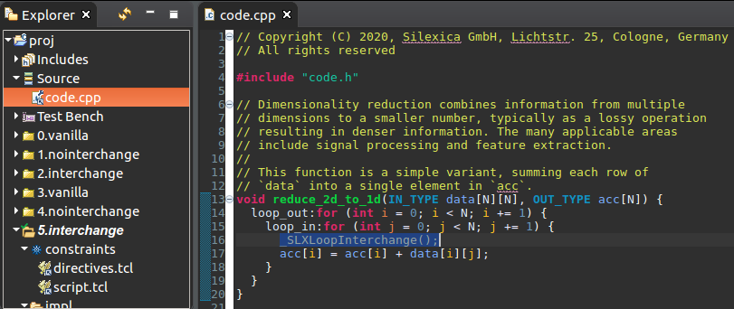

From the File menu, use `Open File ...` and choose `run_hls.tcl` to see the TCL description of the project.  
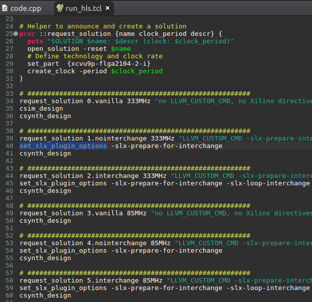

Multiple solutions are opened, exploring:
* 2 clock speeds: 333MHz and 85MHz
* 3 variants of SLX plugin options to see the effects of those options:
  * `vanilla`: remove the `_SLXLoopInterchange` directive and run Vitis HLS with unmodified LLVM-IR.
  * `nointerchange`: perform code simplifications that would enable interchanging, but then remove the `_SLXLoopInterchange` directive.
These transformations can also have an effect on Vitis HLS optimization, and this solution lets us explore this.
  * `interchange`: perform code simplifications that enable interchanging and perform the interchange.
* The new TCL optimization command `set_slx_plugin_options` is used to provide SLX Plugin options for the solution.
  
## Comparing schedules

The reason to use `_SLXLoopInterchange` for this design is to enable pipelining of the inner loop. The floating-point add
in the design is synthesized as a pipelined, multi-cycle instruction for a 333MHz target clock.
The schedule for the solutions `nointerchange` helps to show why pipelining the original code gives a poor result, and
`interchange` shows that interchanging removes the pipeline limiting factor.

The steps to see the `nointerchange` schedule are:
* From the `Project` menu, choose `Set active Solution ...` and then `1.nointerchange` to set that as the active solution:  
  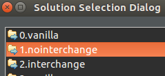
* From the `Solution` menu, choose `Open Schedule Viewer`:  
  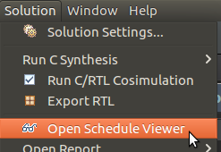
* Then unfold the loop schedules and click on the `add (dadd)` instruction to highlight it in the viewer:  
  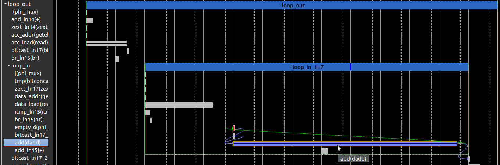

The schedule for the non-interchanged solution shows a problem when pipelining the inner loop. The result of the `add` is
needed in the next iteration of the inner loop - the viewer shows this with a green arrow going from the end of the `add`
instruction back to an earlier instruction that provides an input to the `add`. This means that the full latency of the
add (7 cycles) is part of the initiation interval of the inner loop resulting in it being scheduled with `ii=7`.

The steps to switch to the `interchange` schedule are:
* From the `Project` menu, choose `Set active Solution ...` and then `2.interchange` to set that as the active solution:
* Again unfold the loop schedules in the Schedule Viewer and click on the `add (dadd)` instruction to highlight it in the viewer:  
  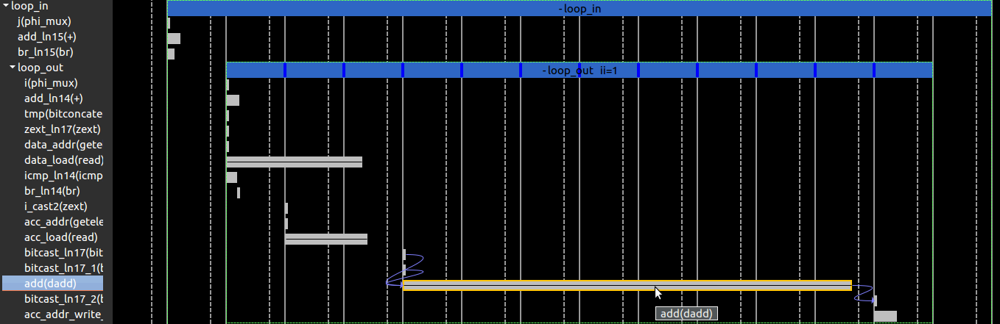

In this schedule there is no green arrow - interchanging has converted the inner-loop inter-iteration dependence (also known as a
loop carried dependence) into an outer-loop dependence. Such a dependence does not limit inner-loop pipelining. Only the
initiation interval of the `add` is involved in pipelining and the inner loop is scheduled with `ii=1.

  
## SLX Plugin Integration in the Vitis HLS IDE

To make it possible to control the SLX Plugin from the Vitis HLS ide, the example makes use of a little bit of extra infrastructure.
When looking at `run_hls.tcl` the new optimization command `set_slx_plugin_options` was already shown. Here we look a bit deeper
at how that command is supported of the IDE will use the right `LLVM_CUSTOM_CMD` during C SYnthesis.

An project-specific file collects the SLX Plugin options per solution for the IDE. Using the `File` menu `Open File ...` and choosing
`proj.slxopts` you see the options resulting from `run_hls.tcl`:  
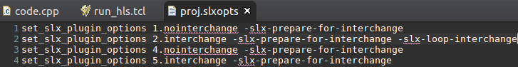
  
To connect this to the IDE, an additional TCL script `scripts/vitis_hls_init.tcl` is provided. Like other optional initialization
files, this is one of the files `vitis_hls` runs if present. Whenever `vitis_hls` runs an initialization script it reports this in
the console output so you can always be aware of what is being run.

If you open the file, using the `File` menu `Open File ...` and choosing `scripts` and then `vitis_hls_init.tcl`, you will see TCL
managing the options provided by `set_slx_plugin_options`, ultimately leading to an extension of the C Synthesis command to first
set the appropriate `LLVM_CUSTOM_CMD` before running Xilinx's C Synthesis.  
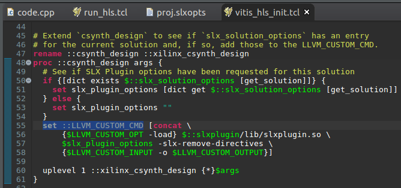

## Dive deeper - LLVM-IR and opt tool

As the `LLVM_CUSTOM_CMD` is using the standard LLVM `opt` tool, `opt` arguments can be used to see some more details.
The option `-time-passes` asks `opt` to report the passes used and `-view-cfg` to view the llvm-ir that is produced.
These options help see what the SLX Plugin is doing in response to the plugin options.

Aside: `-view-cfg` produces a DOT file and uses the unix command `xdg-open` to view it.  If `xdg-mime query default text/vnd.graphviz`
reports nothing on your system then you need to configure an application to view that format or open the `dot` file that gets reported
in the Vitis HLS console when the `LLVM_CUSTOM_CMD` is run.

Using the `set_slx_plugin_options` commands in `proj.slxopts` these additional `-view-cfg -time-passes` options can be passed
to the `LLVM_CUSTOM_CMD`:  
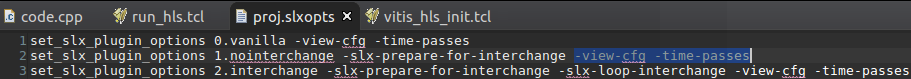

The solutions being examined can be re-synthesized from the `Solution` menu, `Run C Synthesis` -> `Select Solutions ...` and choose
the solutions `0.vanilla`, `1.nointerchange` and `2.interchange`.
  
  
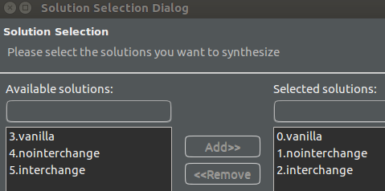
  
### LLVM-IR Control Flow Graphs for the Solutions
As synthesis of each solution completes the `LLVM_CUSTOM_CMD`, `opt -view-cfg` will ask the system to open the graph files.
On my system that is configured to open in my browser.

The first graph that opens is for `vanilla`. Focusing on the innermost cycle in the graph, the inner loop, the LLVM-IR
graph shows that the loop test is at the top of the loop, before the body of the loop is executed. This is a classical
`for` loop.  
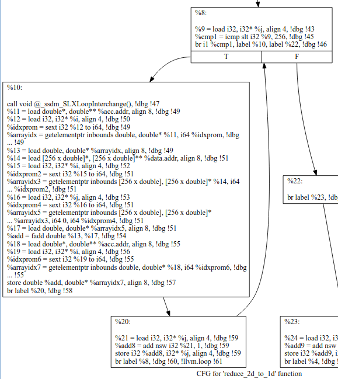

The second graph that opens is for `nointerchange`. The inner loop now has the loop test is at the end of the loop's body. 
The compiler has spotted that the first iteration will always run and the loop can be simplified to a classical
`do-while` loop. There are other less important changes too, but this is the main one. The loop itself is still controlled
by the  `j` variable.  
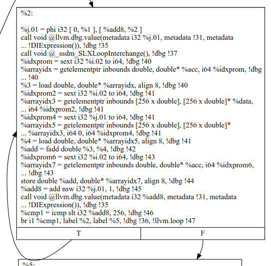

The third graph that opens is for `interchange`. The inner loop is still in `do-while` form, but it is now controlled
by the  `i` variable.  
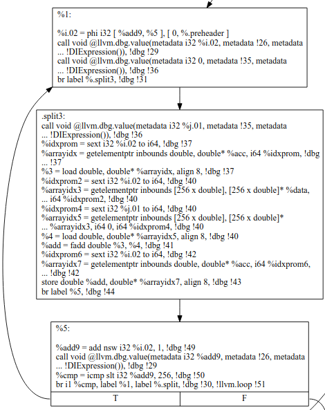

### LLVM-IR Passes
Returning to the Vitis HLS IDE, the information from `time-passes can be seen in the `Console` view.   
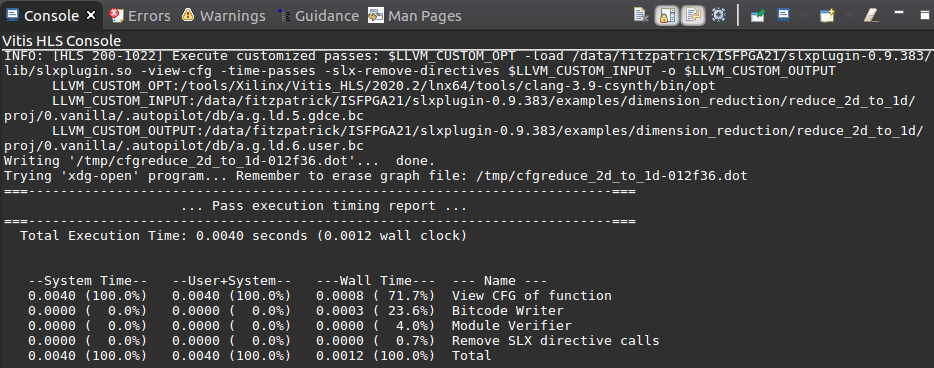

The first `LLVM_CUSTOM_CMD` is for `vanilla`. A single option `-slx-remove-directives` is passed to delete
the `_SLXLoopInterchange` directive from the LLVM-IR so it will not be implemented and also not disturb
the Vitis HLS compiler. `opt` reports this small number of passes are run:
* Bitcode Writer
* Module Verifier
* Remove SLX directive calls
* View CFG of function

The second `LLVM_CUSTOM_CMD` for the `nointerchange` solution additionally passes `-slx-prepare-for-interchange`. This
causes a pass to run to prepare the LLVM-IR for loop interchange. It does this preparation work using a number of other
LLVM passes in a controlled way to minimize the risk of producing LLVM-IR that Vitis HLS does not optimize well. The
main pass here is `Rotate Loops`, which is the pass that rewrites the loops in `do-while` form. The additional passes
are:
* Assumption Cache Tracker
* Basic Alias Analysis (stateless AA impl)
* CallGraph Construction
* Canonicalize natural loops
* Deduce function attributes
* Dominator Tree Construction
* Function Alias Analysis Results
* Inliner for always_inline functions
* LCSSA Verifier
* Loop-Closed SSA Form Pass
* Natural Loop Information
* Profile summary info
* Promote Memory to Register
* Rotate Loops
* Run passes to prepare the IR for SLX interchange
* Scalar Evolution Analysis
* Simplify the CFG
* Target Library Information

The third `LLVM_CUSTOM_CMD` for the `interchange` solution additionally passes `-slx-interchange`. This
also uses additional LLVM-IR analysis passes to support the task of checking that interchanging will
not change the meaning of the program:
* Dependence Analysis
* Lazy Block Frequency Analysis
* Lazy Branch Probability Analysis
* Optimization Remark Emitter
* SLX Loop Interchange

## Comparing the reports
The SLX Plugin is made to extend the rich set of optimization directives in Vitis HLS.
Comparing synthesis reports of the solutions examined above makes the effects clear for
this example. The comparison can be done from the `Project` menu `Compare Reports ...`
and choosing `0.vanilla`, `1.nointerchange` and `2.interchange` and looking at
the effects of the SLX Plugin options on timing, latency and area for this design.  
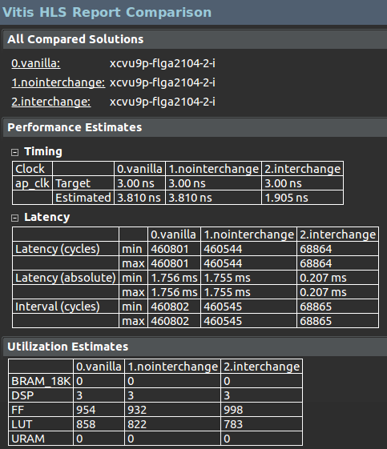

  
## What Next

The walk-through above explored only the design when targeting a 333MHZ clock. The solutions
`3.vanilla`, `4.nointerchange` and `5.interchange` are the equivalent solutions at 85MHz.
Applying some of the steps to those solutions helps illustrate that this use of loop
interchange is less important if the inter iteration dependency is not multi cycle.

There are a number of other examples provided in [slxplugin/examples](slxplugin/examples) with
accompanying explanation in the [SLX Plugin User Guide](slxplugin/doc/user-guide/slxplugin-user-guide.pdf).
Note these provide a `run_hls.tcl` to prepare the project for exploration of the results in the IDE,
but do not provide the `init.tcl` scripting to support re-synthesizing from within the IDE.
You may also need to follow installation steps as given in the [SLX Plugin User Guide](slxplugin/doc/user-guide/slxplugin-user-guide.pdf).

Please do see if you also have designs involving perfect loop nests to understand if,
at certain design points, interchanging would be beneficial. Using the SLX Plugin and
the multi-solution approach illustrated in this tutorial you can quickly investigate
the results of applying a set of optimization directives to your design. And feel free
to check out https://www.silexica.com/products/slx-fpga/ if you want a hand searching
for that elusive best optimization set for your designs.


